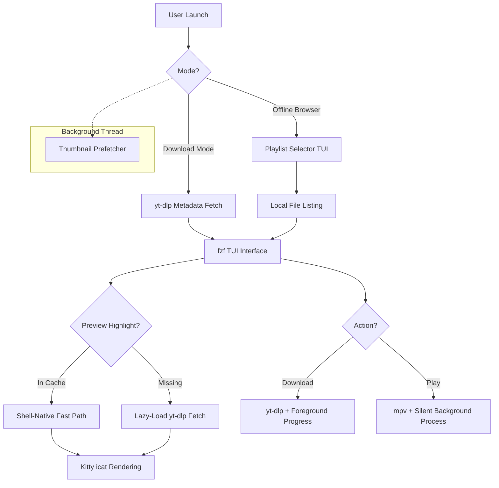

# 🎥 Simple TUI Youtube Playlist Saver

> [!IMPORTANT]
> This project is **Truly Vibecoded**. It was built with high-velocity iterations, near-instant feedback, and a focus on terminal aesthetics.

A high-performance, single-file YouTube playlist manager with a Yazi-like TUI experience. It features near-instant thumbnail previews, background prefetching, and a powerful offline browser for your entire collection.

---

## 🚀 Key Features

- **Shell-Native Instant Previews**: Bypasses Python startup for cached thumbnails using a shell "fast path" with `kitty +kitten icat`. Previews are as fast as a native file manager.
- **Offline Browser (`--watch`)**: Browse your entire `./playlists/` collection without needing a URL. Mix and match multiple playlists into a single session.
- **Background Prefetching**: Automatically populates your local thumbnail cache while you browse.
- **Truly Silent Playback**: Silences both `stdout` and `stderr` for `mpv`, ensuring a clean terminal during playback.
- **Consolidated Architecture**: Single-file Python logic (`save-playlist.py`) managed by `uv`.

---

## 📦 Setup & Installation

Ensure you have [uv](https://github.com/astral-sh/uv) and a [Kitty-graphics-compatible](https://sw.kovidgoyal.net/kitty/graphics-protocol/) terminal installed.

1. **Clone the repository**:
   ```bash
   git clone <repo-url>
   cd playlist-saver
   ```

2. **Sync dependencies**:
   ```bash
   uv sync
   ```

3. **External Requirements**:
   - `fzf` (system binary)
   - `mpv` (or your player of choice)
   - `kitty` (for graphics previews)

---

## 🕹 Usage

### Online: Download and Sync
```bash
uv run save-playlist.py "https://www.youtube.com/playlist?list=..."
```
or
```bash
./run.sh "https://www.youtube.com/playlist?list=..."
```
or, using [run](https://github.com/Quicksilver151/CustomTools/blob/0ccbe1eb86e1ab6acf8b6d1ada08b40f77aeba31/useful%20extras/run.sh)
```bash
run "https://www.youtube.com/playlist?list=..."
```

### Offline: Browse and Watch
```bash
# Browse your entire collection
uv run save-playlist.py --watch

# Or jump to a specific playlist by URL
uv run save-playlist.py "URL" --watch
```

**Global TUI Controls**:
- **`j / k`**: Navigate items. 
- **`Tab`**: Select multiple (for Batch Download or Playlists).
- **`Enter`**: Confirm Selection (Download or Play).
- **`Ctrl-A`**: Select All and start action.
- **`Ctrl-R`**: Refresh list.
- **`Esc`**: Quit.

---


## ⚙️ Configuration

Control your preferences in `config.toml`.

```toml
# save-playlist config

# Whether to use cookies from your browser for YouTube authentication
use_cookies = true

# Which browser to extract cookies from (e.g., "firefox", "chrome", "edge")
browser = "firefox"

# YouTube-DL remote components to load (e.g., ["ejs:github"])
remote_components = ["ejs:github"]

# System video player for offline --watch mode (e.g., "mpv", "vlc")
video_player = "mpv"

# Download presets are checked in order — the first match based on duration wins.
[[presets]]
max_duration = 600   # 720p for 10 minute videos
max_height   = 720

[[presets]]
max_duration = 3600  # 360p for 1 hour videos
max_height   = 360
```


---

## 🛠 Technical Architecture

The project is designed for maximum TUI responsiveness by minimizing the "hot path" for heavy operations.



### Technical Highlights:
- **Fast Path Previews**: `fzf`'s preview command uses a tiny shell snippet to `find` cached images. This eliminates the ~0.5s Python/yt-dlp import lag per item.
- **Lazy Imports**: `yt_dlp` is only imported when a download or a missing thumbnail fetch is actually triggered.
- **Recursive Terminal Buffer Protection**: Uses `--silent` and `--stdin=no` flags with `icat` to prevent graphics escape sequences from leaking into the TUI input line.
- **Selection-Order Merging**: When browsing multiple offline playlists, the TUI respects the exact order in which you selected the folders.

